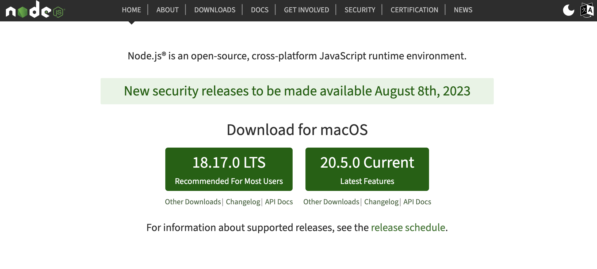

# 📝 React
### 1. 리액트 개발 환경 세팅하기
[node.js 공식사이트](https://nodejs.org/en)


* 오른쪽 current는 최신버전, LTS는 조금 더 안정적으로 동작하는 버전이기 때문에 권장.
* 설치 후 터미널에서 node -v 입력 후 버전(ex. v18.17.0) 나타나면 정상적으로 설치 됨.
  
### 2. 리액트 프로젝트 생성
**터미널에서 명령어 입력** <br>
**(1)** 리액트 폴더 생성<br>
**(2)** `프로젝트를 생성하는 명령어` : npm init react-app .  (마침표는 현재 디렉토리에서 프로젝트를 만들겠다는 의미)<br>
npm init react-app <폴더이름> 혹은 vs code로 열고 터미널에서 npm init react-app .  <br>
**(3)** `개발 모드 실행` : npm run start <br>
**(4)** `개발 모두 종료` : ctrl + c

### 3. index.js, index.html 역할
* `index.html` : 웹 브라우저에서 가장 먼저 실행되는 파일<br>
* `index.js` : index.html 파일이 열리고 난 후 실행되는 파일, 리액트 코드들 중에서 가장 먼저 실행.<br>
* `render 메소드` : render 메소드로 html태그를 만들어준다.

```jsx
ReactDom.render(<h1>리액트 연습하기</h1>, document.getElementById('root'));

// <h1>리액트 연습하기</h1> 영역은 리액트에서 지원하는 JSX 문법.
```

### 5. 프래그먼트
```jsx
// 오류나타 남. JSX요소들은 하나의 태그로 감싸줘야 함.
ReactDOM.render(
    <p>안녕!!</p>
    <p>리액트!!</p>
    document.getElementById('root')
);

// div태그로 감싸 오류를 해결할 수 있는데
ReactDOM.render(
    <div>
        <p>안녕!!</p>
        <p>리액트!!</p>
    </div>
    document.getElementById('root')
);

// fragment 태그로 감싸도 해결이 됩니다.
ReactDOM.render(
    <fragment>
        <p>안녕!!</p>
        <p>리액트!!</p>
    </fragment>
    document.getElementById('root')
);
// fragment 이름없는 태그로 축약형 문법을 사용해도 된다.
ReactDOM.render(
    <>
        <p>안녕!!</p>
        <p>리액트!!</p>
    </>
    document.getElementById('root')
);
```

### 6. JSX
* 자바스크립트 확장 문법
* JSX 문법
    * `HTML과 다른 속성명 (카멜 케이스로 작성하기)`
      * 이벤트 속성이나, tabindex같은 속성 일 때 onClick, onBlur, onFocus, onMouseDown, onMouseOver, tabIndex처럼 작성.
      * 예외적으로 HTML에서 비표준 속성을 다룰 때 활용 data-* 속성은 카멜 케이스가 아니라 기존의 HTML 문법 그대로 작성.

    * `자바스크립트 예약어와 같은 속성명은 사용할 수 없음`
      * for나 class처럼 자바스크립트의 문법에 해당하는 예약어와 똑같은 속성명은 사용할 수 없음
      * htmlFor로, className으로 작성해 주어야 한다
    
    * `하나의 요소로 감싸기 (Fragment)`
      * 여러 개의 요소를 작성하면 오류가 발생하기 때문에 Fragment로 감싸준다 (Fragments는 빈 태그로 감싸는 단축 문법으로도 활용 <> </>)

    * `중괄호 안에서 if문, for문 다룰 수 없음`
      * JSX 문법에는 중괄호 자바스크립트 표현식을 다룰 때 사용 하기 때문에 if,for문을 다룰 수 없음
      * 조건문, 반복문이 필요할 경우 배열의 반복 메소드를 활용